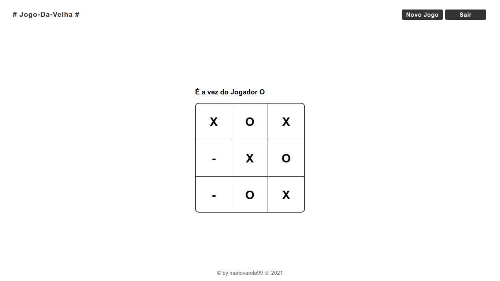

# Jogo da Velha

## Descrição

Um projecto básico, feito com HTML, CSS, e Javascript, com o objectivo de aumentar as habilidades em Javascript no que concerne as condições, funções, eventos, Manipulação da DOM, Modais, Tratamentos de erros, Implementação de Audio e muito mais.

## Objectivo

> A princípio o objectivo era apenas passar o tempo, fazendo algums coisa, visto que programação já faz parte do meu dia-a-dia, e então quando meti a mão na massa passou de um simples passa tempo à um desafio básico.! E em algumas horas saiu esse Jogo da Velha básico, Em breve as condições serão refactoradas.!

## Built with

1. HTML
2. CSS
3. Javascript

## Experiência adquirida

1. Tratamento de Audio a nível básico com JS
2. Estruturas condicionais aninhadas
3. Aperfeiçoamento no conhecimento de Funções e Arrays
4. Testando alguma Lógica de Programação
5. Aumento na velocidade da resolução dos problemas pedidos.
   6... Ainda tem mais por vir.!

## Colaboradores

1. 😉 <a href="https://github.com/mariovarela99"> Mário Varela </a>

## Contribuir

```bash
  $ git clone https://github.com/mariovarela99/Jogo-da-Velha-html-css-js
  $ cd Jogo-da-Velha-html-css-js
  $ git checkout -b NewFeature
  $ git add .
  $ git commit -m ":lipstick: Deixando melhor"
  $ git push --set-upstream origin NewFeature
```

E já está.!

## Resultado.!



Sinta-se a Vontade para Partilhar, E usar da maneira que quiser.!
